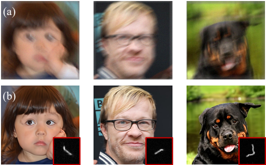

# GibbsDDRM: A Partially Collapsed Gibbs Sampler for Solving Blind Inverse Problems with Denoising Diffusion Restoration (ICML2023, Oral)



This repository contains the code implementation for the paper "GibbsDDRM: A Partially Collapsed Gibbs Sampler for Solving Blind Inverse Problems with Denoising Diffusion Restoration" presented at ICML2023.

## Abstract
Pre-trained diffusion models have been successfully used as priors in a variety of linear inverse problems, where the goal is to reconstruct a signal from noisy linear measurements. However, existing approaches require knowledge of the linear operator. In this paper, we propose GibbsDDRM, an extension of Denoising Diffusion Restoration Models (DDRM) to a blind setting in which the linear measurement operator is unknown. GibbsDDRM constructs a joint distribution of the data, measurements, and linear operator by using a pre-trained diffusion model for the data prior, and it solves the problem by posterior sampling with an efficient variant of a Gibbs sampler. The proposed method is problem-agnostic, meaning that a pre-trained diffusion model can be applied to various inverse problems without fine tuning. In experiments, it achieved high performance on both blind image deblurring and vocal dereverberation tasks, despite the use of simple generic priors for the underlying linear operators.

## Paper and Demos

[Paper on arXiv](https://arxiv.org/abs/2301.12686)

[Creative AI: Demos and Papers, Sony Group Corporation](https://sony.github.io/creativeai/)

## Authors
Naoki Murata<sup>1</sup>, Koichi Saito<sup>1</sup>, Chieh-Hsin Lai<sup>1</sup>, Yuhta Takida<sup>1</sup>, Toshimitsu Uesaka<sup>1</sup>, Yuki Mitsufuji<sup>1,2</sup>, Stefano Ermon<sup>3</sup>

<sup>1</sup> Sony AI, <sup>2</sup> Sony Group Corporation,<sup>3</sup> Stanford University


## Prereqruisites
- python 3.9
- pytorch 1.10.1
- CUDA 11.5.2 (You can use a lower version of CUDA with the corresponding PyTorch version.)

## Getting Started
### 1) Download Pretrained Checkpoint
Download the pretrained checkpoint for the desired dataset from the following external links:
- For FFHQ, download the pretrained model `ffhq_10m.pt` from the [diffusion-posterior-sampling](https://github.com/DPS2022/diffusion-posterior-sampling) repository.
- For AFHQ, download the pretrained model `afhqdog_p2.pt` from the [P2-weighting](https://github.com/jychoi118/P2-weighting) repository.
Please follow the instructions provided by the respective repositories to download the checkpoints and organize them properly.

Move the downloaded checkpoint file to the following locations:
- For FFHQ: `exp/logs/ffhq/ffhq_10m.pt`
- For AFHQ: `exp/logs/afhq/afhqdog_p2.pt`

### 2) Set Up Environment
Clone the MotionBlur repository, which contains the external codes used by our code:
```
git clone https://github.com/LeviBorodenko/motionblur.git
```

Install the required packages using the provided YAML file:
```
conda env create -f requirement.yml
```

Activate the conda environment
```
conda activate GibbsDDRM
```

### 3) Running Inference
For FFHQ, run the following command:
```
python main.py --ni --config ffhq_256_deblur.yml --doc ffhq --deg deblur_arbitral -i deblur_ffhq
```
For AFHQ, run the following command:
```
python main.py --ni --config afhq_256_deblur.yml --doc afhq --deg deblur_arbitral -i deblur_afhq
```


## Citation
If you find this work useful, please consider citing the paper:
[1] Murata, N., Saito, K., Lai, C., Takida, Y., Uesaka, T., Mitsufuji, Y., Ermon, S., "GibbsDDRM: A Partially Collapsed Gibbs Sampler for Solving Blind Inverse Problems with Denoising Diffusion Restoration," 40th International Conference on Machine Learning, 2023.
```
@inproceedings{murata2023gibbsddrm,
  title={Gibbs{DDRM}: A Partially Collapsed Gibbs Sampler for Solving Blind Inverse Problems with Denoising Diffusion Restoration},
  author={Murata, Naoki and Saito, Koichi and Lai, Chieh-Hsin and Takida, Yuhta and Uesaka, Toshimitsu and Mitsufuji, Yuki and Ermon, Stefano},
  booktitle={International Conference on Machine Learning}
  year={2023}
}

```


This implementation is based on: 
[https://github.com/bahjat-kawar/ddrm/](https://github.com/bahjat-kawar/ddrm/)
